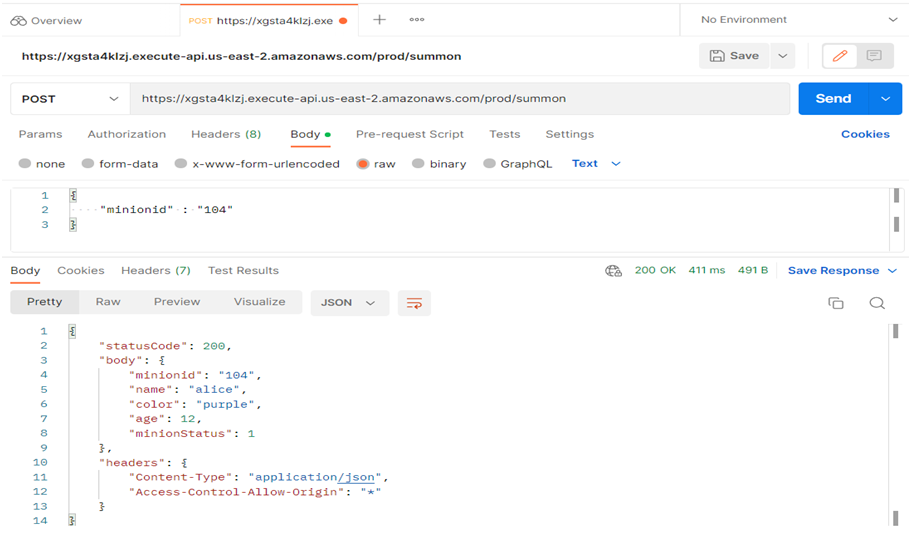
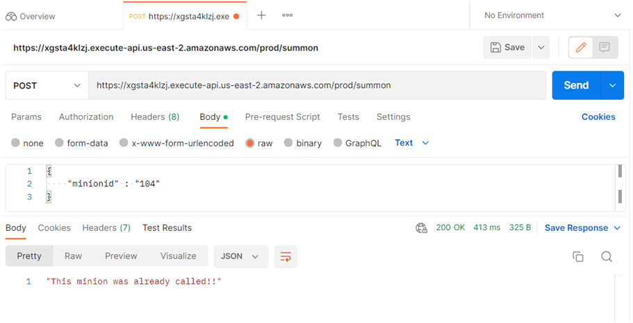
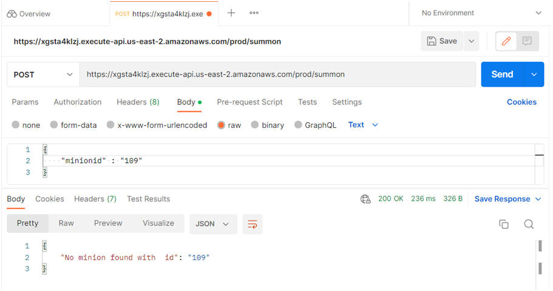

# serverless functions

### A public https post api : https://xgsta4klzj.execute-api.us-east-2.amazonaws.com/prod/summon

### Test Case 1 : When minion is called with minionid, gives us minion details

#### 

### Test Case 2 : When minion is called again, doesn't give us the same dpulicate details

#### 

### Test Case 3 : When called with a nonexistant minionid/etc gives us a meaningful "Minion Not Found" message

#### 

